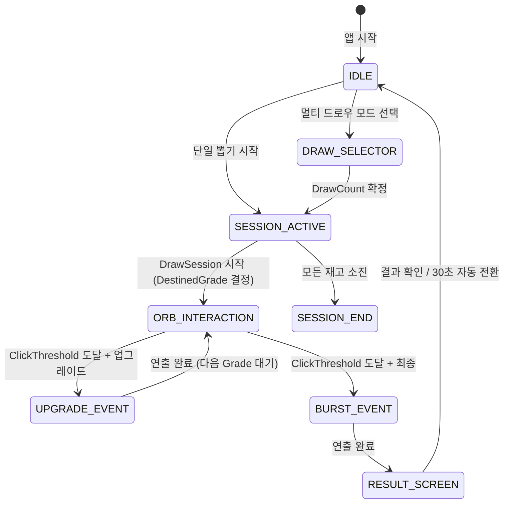

# 설계 문서: 가챠 경품 추첨 게임

## 개요

오프라인 이벤트(팬 사인회, 페스티벌 등)에서 태블릿으로 운영하는 경품 추첨 가챠 게임이다. 던전앤파이터의 "태초 소환" 방식에서 영감을 받아, 참가자가 구체(Orb)를 반복 클릭하면서 등급이 올라가는 연출을 경험하고 최종 확정된 등급의 상품을 수령하는 구조다.

MVP 범위는 유저 게임 화면이며, 관리자 설정값(확률표, 상품 목록, 연속 뽑기 옵션 등)은 사전에 주입된 정적 데이터로 처리한다.

### 기술 스택

| 영역 | 기술 선택 | 선택 이유 |
|------|----------|----------|
| UI 프레임워크 | React 18 + TypeScript | 컴포넌트 기반 상태 관리, 타입 안전성 |
| 빌드 도구 | Vite | 빠른 HMR, 경량 번들 |
| UI 애니메이션 | Motion (motion.dev) | Orb 셰이크/변신·화면 전환 등 DOM 기반 애니메이션을 선언적으로 구현 |
| 이펙트 렌더링 | PixiJS v8 | 파티클·전체 화면 빛 번쩍 등 WebGL 가속이 필요한 이펙트 |
| 상태 관리 | Zustand | 보일러플레이트 없이 심플한 전역 상태 |
| 스타일링 | CSS Modules + CSS Custom Properties | 동적 테마(등급 색상) 지원 |
| 오디오 | Howler.js | 모바일/태블릿 사운드 제어 안정성 |
| 테스트 | Vitest + React Testing Library | Vite 통합, 빠른 실행 |
| 속성 테스트 | fast-check | TypeScript 네이티브 PBT 라이브러리 |

---

## 아키텍처

### 전체 구조

```
src/
├── config/              # 정적 주입 설정값
│   ├── prizes.ts        # 상품 목록
│   ├── probability.ts   # 등급별 확률표
│   └── session.ts       # ClickThreshold, DrawCount 옵션 등
│
├── domain/              # 순수 도메인 로직 (프레임워크 의존 없음)
│   ├── types.ts         # Grade, DrawSession, PrizeResult 등 타입 정의
│   ├── probability.ts   # DestinedGrade 결정 로직
│   ├── inventory.ts     # InventoryTracker 로직
│   └── multiDraw.ts     # MultiDrawManager 로직
│
├── store/               # Zustand 스토어
│   ├── gameStore.ts     # 메인 게임 상태
│   ├── inventoryStore.ts
│   └── historyStore.ts  # PrizeResult 지급 이력
│
├── components/
│   ├── Orb/             # Orb 컴포넌트 (클릭 인터랙션)
│   ├── EffectLayer/     # PixiJS 이펙트 캔버스
│   ├── ResultScreen/    # 결과 화면
│   ├── DrawSelector/    # 멀티 드로우 횟수 선택
│   └── SessionEnd/      # 세션 종료 안내
│
├── effects/             # PixiJS 이펙트 모듈
│   ├── particleEngine.ts
│   ├── flashEffect.ts
│   ├── burstEffect.ts
│   └── gradeEffects.ts  # 등급별 이펙트 설정
│
├── audio/               # 사운드 관리
│   └── soundManager.ts
│
└── hooks/               # React 커스텀 훅
    ├── useOrbInteraction.ts
    ├── useEffectSequencer.ts
    └── useOrientation.ts
```

### 레이어 의존성

```
Config (정적 데이터)
        ↓
Domain (순수 로직, 외부 의존 없음)
        ↓
Store (Zustand, 도메인 로직 호출)
        ↓
Hooks (Store 구독 + 사이드이펙트 조율)
        ↓
Components (UI 렌더링)
        ↓
Effects / Audio (PixiJS, Web Audio)
```

도메인 레이어는 React, Zustand, PixiJS를 전혀 의존하지 않아 단독으로 단위 테스트가 가능하다.

### 게임 상태 흐름



---

## 컴포넌트 및 인터페이스

### 애니메이션 레이어 분리

Motion(DOM)과 PixiJS(캔버스)를 역할에 따라 명확히 분리한다.

| 애니메이션 유형 | 담당 | 이유 |
|--------------|------|------|
| Orb 셰이크 (클릭 피드백) | Motion | DOM transform으로 충분, GPU 가속 자동 적용 |
| Orb 등급 변신 (색상·빛·스케일) | Motion | keyframes + spring으로 자연스러운 전환 |
| 화면 전환 (IDLE↔ORB↔RESULT) | Motion (`AnimatePresence`) | 마운트/언마운트 진입·퇴장 애니메이션 |
| DrawSelector 슬라이드인 | Motion | 간단한 레이아웃 애니메이션 |
| ResultScreen 아이템 등장 | Motion (stagger) | 순차 등장 연출 |
| 파티클 폭발 (BurstEvent) | PixiJS | 수백 개 파티클, WebGL 필요 |
| 전체 화면 빛 번쩍 (UpgradeEvent) | PixiJS | 전체 화면 오버레이, 고성능 필요 |
| 클릭 파티클 (소형) | PixiJS | 실시간 터치 피드백 파티클 |

**Orb 컴포넌트 구현 방식:**
- Orb 자체는 `motion.div` 로 구현
- 셰이크: `useAnimate()` 훅으로 클릭 시 x/y translate 시퀀스 트리거
- 지속 셰이크 (80% 이상): `animate` 함수로 `repeat: Infinity` 진동 루프 실행
- 변신: `animate` 로 `scale`, `boxShadow`, `filter: drop-shadow` 키프레임 전환
- 파티클·빛 이펙트는 아래 레이어의 PixiJS 캔버스가 담당

```typescript
// Orb 컴포넌트 Motion 사용 예시
import { motion, useAnimate } from 'motion/react';

function Orb({ grade, clickCount, clickThreshold, isLocked, onClickRegistered }: OrbProps) {
  const [scope, animate] = useAnimate();
  const intensity = clickCount / clickThreshold; // 0~1

  const handleClick = () => {
    if (isLocked) return;
    // 클릭 셰이크: intensity에 비례한 진폭
    const amp = 4 + intensity * 12;
    animate(scope.current, 
      { x: [0, -amp, amp, -amp/2, amp/2, 0] },
      { duration: 0.3, ease: 'easeInOut' }
    );
    onClickRegistered();
  };

  return (
    <motion.div
      ref={scope}
      className={styles.orb}
      style={{ '--grade-color': GRADE_COLORS[grade] } as CSSProperties}
      onPointerDown={handleClick}
      // 80% 이상 지속 셰이크는 useEffect + animate()로 별도 관리
    />
  );
}
```

---

### 핵심 컴포넌트

#### `GachaApp` (루트 컴포넌트)

전체 게임 상태에 따라 화면을 전환하는 최상위 라우터 역할이다.

```typescript
type GamePhase =
  | 'IDLE'
  | 'DRAW_SELECTOR'
  | 'ORB_INTERACTION'
  | 'UPGRADE_EVENT'
  | 'BURST_EVENT'
  | 'RESULT_SCREEN'
  | 'SESSION_END';
```

#### `Orb` 컴포넌트

- CSS Custom Properties로 등급별 색상·광원 효과를 동적 적용
- `useOrbInteraction` 훅을 통해 클릭 이벤트 처리
- PixiJS 캔버스 위에 오버레이되는 HTML 요소로 터치 이벤트 수신 후 PixiJS 이펙트 트리거

```typescript
interface OrbProps {
  grade: Grade;
  clickCount: number;
  clickThreshold: number;
  isLocked: boolean; // 이벤트 재생 중 입력 차단
  onClickRegistered: () => void;
}
```

#### `EffectLayer` 컴포넌트

PixiJS Application을 감싸는 React 컴포넌트. 전체 화면 크기의 캔버스를 관리한다.

```typescript
interface EffectLayerHandle {
  playUpgradeEffect: (fromGrade: Grade, toGrade: Grade) => Promise<void>;
  playBurstEffect: (grade: Grade) => Promise<void>;
  playClickEffect: (position: Point, intensity: number) => void;
  playIdleEffect: (intensity: number) => void; // 80% 이상 구간의 지속 흔들림
}
```

`Promise<void>` 반환으로 이펙트 완료 시점을 명확히 제어한다.

#### `ResultScreen` 컴포넌트

```typescript
interface ResultScreenProps {
  prizeResult: PrizeResult;
  drawHistory: PrizeRecord[]; // 당일 지급 이력
  onConfirm: () => void;
  autoCloseSeconds: number; // 기본 30초
}
```

#### `DrawSelector` 컴포넌트

```typescript
interface DrawSelectorProps {
  options: DrawCountOption[]; // 설정값에서 주입 (예: [1, 5, 10])
  availableStock: number;     // 현재 전체 잔여 재고
  onSelect: (count: number) => void;
}
```

### 커스텀 훅

#### `useOrbInteraction`

Orb 클릭 로직과 이펙트 트리거를 조율한다.

```typescript
function useOrbInteraction(params: {
  clickThreshold: number;
  destinedGrade: Grade;
  onUpgrade: (nextGrade: Grade) => void;
  onBurst: (finalGrade: Grade) => void;
}): {
  clickCount: number;
  currentGrade: Grade;
  isLocked: boolean;
  handleOrbClick: () => void;
}
```

#### `useEffectSequencer`

UpgradeEvent와 BurstEvent의 연출 시퀀스를 Promise 체인으로 관리한다.

```typescript
function useEffectSequencer(effectLayerRef: RefObject<EffectLayerHandle>): {
  playUpgradeSequence: (from: Grade, to: Grade) => Promise<void>;
  playBurstSequence: (grade: Grade) => Promise<void>;
}
```

#### `useOrientation`

화면 방향 변환을 감지하고 레이아웃 재구성을 트리거한다.

```typescript
function useOrientation(): {
  orientation: 'landscape' | 'portrait';
  isTransitioning: boolean;
}
```

---

## 데이터 모델

### 핵심 타입

```typescript
// 등급 (순서 중요 - 비교 연산에 사용)
export type Grade = 'Normal' | 'Rare' | 'Epic' | 'Primeval';

export const GRADE_ORDER: Grade[] = ['Normal', 'Rare', 'Epic', 'Primeval'];

export function gradeIndex(g: Grade): number {
  return GRADE_ORDER.indexOf(g);
}

export function isHigherGrade(a: Grade, b: Grade): boolean {
  return gradeIndex(a) > gradeIndex(b);
}
```

```typescript
// 상품 설정 (정적 주입)
export interface PrizeConfig {
  id: string;
  name: string;
  grade: Grade;
  imageUrl: string;
  initialStock: number;
}

// 확률표 (정적 주입)
export interface ProbabilityTable {
  Normal: number;   // 예: 0.60
  Rare: number;     // 예: 0.30
  Epic: number;     // 예: 0.08
  Primeval: number; // 예: 0.02
  // 합계 = 1.0 (타입 불변식)
}

// DrawSession 런타임 상태
export interface DrawSession {
  id: string;
  destinedGrade: Grade;
  currentGrade: Grade;
  clickCount: number;
  clickThreshold: number;
  isMultiDraw: boolean;
  drawCount: number;           // 멀티 드로우 시 전체 횟수
  destinedGrades: Grade[];     // 멀티 드로우 시 전체 등급 목록
  maxGrade: Grade;             // 멀티 드로우 시 최고 등급
  status: DrawSessionStatus;
}

export type DrawSessionStatus =
  | 'WAITING_CLICK'
  | 'UPGRADE_IN_PROGRESS'
  | 'BURST_IN_PROGRESS'
  | 'COMPLETED';

// 최종 결과
export interface PrizeResult {
  prizeId: string;
  prizeName: string;
  grade: Grade;
  imageUrl: string;
}

// 이력 기록 (ResultScreen 하단 목록)
export interface PrizeRecord {
  prizeResult: PrizeResult;
  issuedAt: Date;
  sequenceNumber: number; // 당일 지급 순서
}
```

### 재고 상태

```typescript
export interface InventoryState {
  stocks: Record<string, number>; // prizeId → 잔여 수량
  exhaustedGrades: Set<Grade>;    // 소진된 등급
}

// InventoryTracker 순수 함수 인터페이스
export interface InventoryOperations {
  deductStock(state: InventoryState, prizeId: string): Result<InventoryState, InventoryError>;
  isGradeExhausted(state: InventoryState, grade: Grade): boolean;
  getAvailableGrades(state: InventoryState): Grade[];
  getTotalStock(state: InventoryState): number;
  resolveFallbackGrade(
    state: InventoryState,
    targetGrade: Grade
  ): Grade | null; // null = 전체 소진
}

export type InventoryError =
  | { type: 'STOCK_ALREADY_ZERO'; prizeId: string }
  | { type: 'PRIZE_NOT_FOUND'; prizeId: string };

// Result 타입 (에러를 타입으로 표현)
export type Result<T, E> = { ok: true; value: T } | { ok: false; error: E };
```

### 설정값 (정적 주입)

```typescript
// config/session.ts
export interface SessionConfig {
  clickThreshold: number;          // 5~20 범위 정수
  drawCountOptions: number[];      // 예: [1, 5, 10]
  autoCloseSeconds: number;        // 결과 화면 자동 전환 (기본 30)
  soundEnabled: boolean;
}

// config/probability.ts
export const DEFAULT_PROBABILITY_TABLE: ProbabilityTable = {
  Normal: 0.60,
  Rare: 0.30,
  Epic: 0.08,
  Primeval: 0.02,
};
```

### 이펙트 설정 (등급별)

```typescript
export interface GradeEffectConfig {
  grade: Grade;
  orbColor: string;               // CSS color
  orbGlowColor: string;
  particleColor: string;
  particleCount: number;
  burstDuration: number;          // ms
  burstSoundKey: string;
  upgradeSoundKey: string;
}

// Primeval의 burstDuration은 다른 등급 중 최대값 × 2 이상 보장
export const GRADE_EFFECTS: Record<Grade, GradeEffectConfig> = {
  Normal:   { /* ... */ burstDuration: 1500 },
  Rare:     { /* ... */ burstDuration: 2000 },
  Epic:     { /* ... */ burstDuration: 3000 },
  Primeval: { /* ... */ burstDuration: 7000 }, // 3000 * 2 이상
};
```

---

## 정확성 속성 (Correctness Properties)

*속성(Property)은 시스템의 모든 유효한 실행에서 참이어야 하는 특성 또는 동작이다. 즉, 시스템이 무엇을 해야 하는지에 대한 공식적인 명세다. 속성은 사람이 읽을 수 있는 명세와 기계로 검증 가능한 정확성 보증 사이의 다리 역할을 한다.*

### Property 1: 확률표 유효성 불변식

*어떤* 유효한 확률표에 대해서도, 모든 등급의 확률 합은 정확히 1.0이고 각 등급 확률은 0 초과 1 미만의 실수여야 한다.

**Validates: Requirements 1.13, 2.6**

---

### Property 2: DestinedGrade는 항상 재고가 있는 유효한 등급

*어떤* 확률표와 재고 상태 조합에 대해서도, `resolveDestinedGrade()` 함수는 항상 재고가 1 이상인 등급 중 하나를 반환해야 한다 (전체 소진 상태가 아닌 한).

**Validates: Requirements 2.1, 2.4, 3.4**

---

### Property 3: 재고 차감 정확성 및 음수 불가

*어떤* 초기 재고 상태와 유효한 차감 시퀀스에 대해서도, 총 차감 횟수만큼 각 상품의 재고가 정확히 감소해야 하며 음수가 되어서는 안 된다. 재고가 0인 상품에 차감을 시도하면 항상 에러 Result가 반환되어야 한다.

**Validates: Requirements 3.1, 3.2, 3.3**

---

### Property 4: Orb 클릭 카운트 단조 증가 및 RevealEvent 정확성

*어떤* WAITING_CLICK 상태의 DrawSession에서도, 클릭을 등록하면 clickCount가 정확히 1 증가하거나(미임계) ClickThreshold에 도달한 경우 RevealEvent(UpgradeEvent 또는 BurstEvent)가 발생해야 한다. currentGrade < destinedGrade이면 UpgradeEvent가, currentGrade == destinedGrade이면 BurstEvent가 발생해야 한다. clickCount가 감소하거나 2 이상 증가하는 경우는 없어야 한다.

**Validates: Requirements 1.2, 1.5, 1.6, 1.7**

---

### Property 5: DrawSession 중 DestinedGrade 불변성

*어떤* DrawSession이 WAITING_CLICK 또는 UPGRADE_IN_PROGRESS 상태에 있는 동안, 임의의 클릭·업그레이드 이벤트를 적용해도 destinedGrade 값은 세션 시작 시 확정된 값에서 변경되어서는 안 된다.

**Validates: Requirements 2.2**

---

### Property 6: 잠금 상태에서 클릭 입력 무시

*어떤* isLocked=true인 DrawSession 상태에서도, 클릭 입력을 받으면 clickCount, currentGrade, destinedGrade 등 모든 게임 상태가 변경되지 않아야 한다.

**Validates: Requirements 1.10**

---

### Property 7: 멀티 드로우 MaxGrade는 destinedGrades 배열의 최댓값

*어떤* DrawCount와 DestinedGrade 배열에 대해서도, MaxGrade는 해당 배열의 모든 등급 중 GRADE_ORDER 기준으로 가장 높은 등급과 동일해야 한다.

**Validates: Requirements 5.3**

---

### Property 8: 멀티 드로우 결과 목록 항목 수는 DrawCount와 동일

*어떤* 유효한 멀티 드로우 세션에 대해서도, ResultScreen에 표시되는 결과 목록의 항목 수는 DrawCount와 정확히 동일해야 한다.

**Validates: Requirements 5.6**

---

### Property 9: 재고 폴백은 항상 재고 양수인 등급

*어떤* 재고 상태와 목표 등급에 대해서도, `resolveFallbackGrade()` 함수가 null이 아닌 등급을 반환할 때 반환된 등급의 재고는 반드시 1 이상이어야 한다.

**Validates: Requirements 2.4, 3.5**

---

### Property 10: 이력 기록 지급 순서 단조 증가 및 중복 없음

*어떤* PrizeRecord 목록에 대해서도, sequenceNumber는 issuedAt 시간 순서와 일치하며 중복 없이 단조 증가해야 한다. 또한 최대 50건만 표시되어야 한다.

**Validates: Requirements 4.4**

---

## 에러 처리

### 에러 유형 및 처리 전략

| 에러 상황 | 처리 방식 | 사용자 노출 |
|----------|----------|------------|
| 이미지 로드 실패 | 등급 색상 + 이름 텍스트로 폴백 | 투명하게 처리 |
| 사운드 파일 로드 실패 | 콘솔 경고 기록, 시각 이펙트만 재생 | 노출 안 함 |
| 진동 미지원 기기 | `navigator.vibrate` 존재 여부 확인 후 무시 | 노출 안 함 |
| 재고 음수 차감 시도 | `Result<T, E>` 타입으로 에러 반환, 콘솔 기록 | 노출 안 함 |
| 확률표 합계 불일치 | 앱 시작 시 assertion으로 즉시 중단 | 개발 오류로 처리 |
| 전체 재고 소진 | 세션 종료 화면 전환 | SessionEnd 컴포넌트 표시 |
| PixiJS WebGL 미지원 | Canvas 2D 모드로 자동 폴백 | 노출 안 함 |
| 화면 방향 전환 중 이벤트 재생 | 전환 완료(1초) 후 상태 복원 | 잠시 로딩 표시 |

### 에러 경계 구조

```
<ErrorBoundary>          ← 전체 앱 최상위
  <GachaApp>
    <EffectLayer />      ← PixiJS 초기화 실패 시 Canvas 폴백
    <Orb />
    <ResultScreen />
  </GachaApp>
</ErrorBoundary>
```

### 설정값 검증

앱 부트스트랩 시 `validateConfig()` 함수를 실행하여 정적 설정의 불변식을 확인한다.

```typescript
function validateConfig(config: SessionConfig, probTable: ProbabilityTable, prizes: PrizeConfig[]): void {
  // 1. 확률 합계 = 1.0 (±0.001 오차 허용)
  const sum = Object.values(probTable).reduce((a, b) => a + b, 0);
  assert(Math.abs(sum - 1.0) < 0.001, 'Probability table must sum to 1.0');

  // 2. ClickThreshold 범위 확인
  assert(config.clickThreshold >= 5 && config.clickThreshold <= 20, 'ClickThreshold out of range');

  // 3. 모든 등급에 상품 최소 1개 존재
  for (const grade of GRADE_ORDER) {
    const count = prizes.filter(p => p.grade === grade).length;
    assert(count > 0, `No prizes defined for grade: ${grade}`);
  }
}
```

---

## 테스트 전략

### 이중 테스트 접근법

단위 테스트는 구체적인 예시·엣지 케이스·에러 조건을 검증하고, 속성 테스트(PBT)는 전체 입력 공간에 걸쳐 보편적 속성을 검증한다. 두 방식은 상호 보완적이다.

### 도구

- **단위 테스트**: Vitest + React Testing Library
- **속성 테스트**: fast-check (TypeScript 네이티브 PBT 라이브러리)
- **이펙트 테스트**: PixiJS 모킹 + jest-canvas-mock
- 각 속성 테스트는 최소 **100회 이상** 반복 실행

### 속성 테스트 설정 예시

```typescript
import fc from 'fast-check';
import { describe, it } from 'vitest';

describe('Property 1: 확률표 확률 합산 불변식', () => {
  // Feature: gacha-prize-game, Property 1: 확률표 확률 합산 불변식
  it('모든 등급 확률의 합은 1.0이어야 한다', () => {
    fc.assert(
      fc.property(
        validProbabilityTableArbitrary(),
        (table) => {
          const sum = Object.values(table).reduce((a, b) => a + b, 0);
          return Math.abs(sum - 1.0) < 0.001;
        }
      ),
      { numRuns: 200 }
    );
  });
});
```

### 테스트 레이어별 커버리지

#### 도메인 레이어 (순수 함수, 높은 커버리지 목표)

- `probability.ts`: DestinedGrade 결정 분포 검증 (Property 1, 2)
- `inventory.ts`: 재고 차감·폴백·소진 상태 전환 (Property 3, 9)
- `multiDraw.ts`: MaxGrade 결정, 항목 수 일치 (Property 7, 8)
- `session 상태 전환`: 클릭 단조 증가, Grade 불변성 (Property 4, 5, 6)
- 이력 기록 순서 일관성 (Property 10)

#### 컴포넌트 레이어 (예시 기반)

- Orb 클릭 비활성화 상태(isLocked=true) 시 입력 무시
- ResultScreen 이미지 로드 실패 시 폴백 렌더링
- DrawSelector DrawCount가 재고를 초과할 때 버튼 비활성화
- 30초 자동 전환 타이머

#### 통합 테스트

- 단일 드로우 전체 흐름: DrawSession 시작 → Orb 클릭 → RevealEvent → ResultScreen
- 멀티 드로우 전체 흐름: DrawCount 선택 → MaxGrade 연출 → 목록 ResultScreen
- 화면 방향 전환 후 게임 상태 유지
- 전체 재고 소진 후 SessionEnd 전환

### 성능 테스트

- EffectLayer 60fps 유지: PixiJS ticker에서 렌더링 시간 측정, 16.7ms 초과 시 경고
- 멀티 드로우 10개 시 DestinedGrade 확정 성능: 1ms 이내

